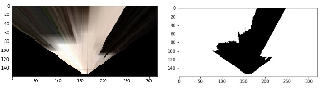
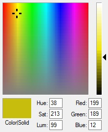
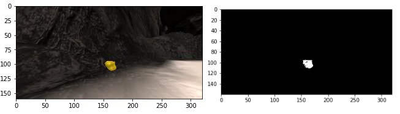
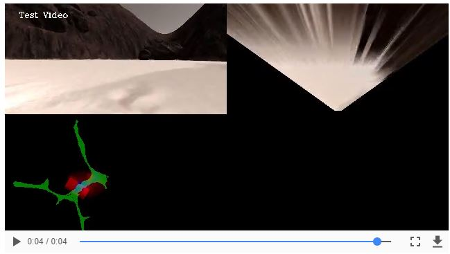
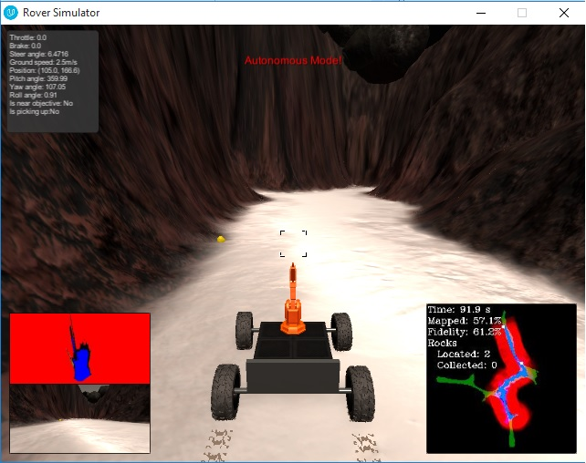
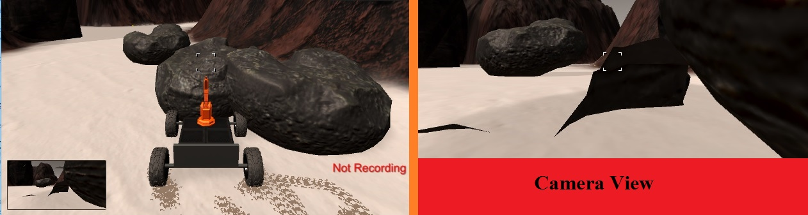

### Notebook Analysis
#### 1. Obstacles and rock samples Identification.
Identifying obstacles was so easy. It was done by using the same rgb_threshold for navigable terrain, but inversing the color selection. `obs_thresh()` function was used in identifying  obstacles in an image.

While Identifying rock samples was a little bit trickier. I have used a very simple technique to know the right choice for a color threshold range, the color tool in Paint.

Although detecting a certain color is much easier using HSI color space, I found it better to stick with the RGB space and not to burden myself with the conversion between these two color spaces.
`rock_thresh()` function was used in detecting a rock sample with a color threshold range from `(140, 100, 0)` to `(255, 255, 80)` RGB.

#### 2. `process_image()` function Implementation.
Implementing `process_image()` function was done by using all the analysis steps provided throughout the project together with the `Databucket()` class.
The image shows a screenshot of the video output from the notebook.

### Autonomous Navigation and Mapping

#### 1. `perception.py` and `decision.py` script files.
In `decision.py`, I have tried to implement the wall crawler technique by adding a `steer_bias` variable with a value of 0.2 to steer the rover a little bit to the left.
In `drive_rover.py`, the `Rover.throttle_set` and `Rover.max_vel` were changed to 0.5 and 2.5 respectively. Speed was increased and the total time was minimized.
In `perception.py`, the `rock_thresh()` function was added to identify rock samples. And `perception_step()` was implemented almost the same as `process_image()` function from the notebook.

#### 2. Autonomous mode results and future improvements.
The results show that the rover passes the minimum requirements of the project. However, to increase the fidelity much more some improvements could be added. For example, the range of the camera view could be minimized to increase the fidelity.

Another problem that I have encountered was the obstacles(rock) scattered in the middle of the map. At first, I thought it was just a simulation bug as the camera view shows a navigable terrain right through the rock, as shown in the image below. However, I have found that many people had the same problem and they actually tried to work around the problem and fix it.

> **Simulator Settings:-**
> - **screen resolution** = 640*480
> - **graphics quality** = Good
> - **FPS** = 20
